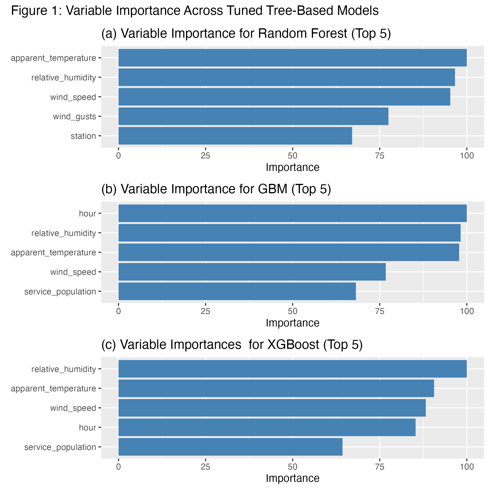

### Model Performance

Table 1 presents the traing and testing RMSE, MAE, and R2 for all five models. The best model can be obtained by looking for the model with the lowest RMSE and MAE, and the highest R2 on the test set.

```{r, warning=FALSE, echo=FALSE}
library(htmltools)
includeHTML("plots/model_perf_table.html")
```

As shown in Table 1, the Gradient Boosting model achieved the best overall performance, with a test RMSE of 4.752, a test MAE of 3.273, and a test R2 of 0.017. However, the improvement over the other models is marginal, as the test RMSE, MAE, and R2 values for the remaining models are similarly close. Notably, all models exhibit R2 values near zero, indicating that they explain very little of the variance in delay duration. This suggests that, despite tuning and a diverse set of predictors, none of the models are very effective at accurately predicting subway delay durations.

#### Variable Importance

Table 2 presents the GLM coefficient summary, including an additional column indicating whether each predictor is statistically significant (p < 0.05). Similarly, Table 3 and Table 4 display the GAM summary, with Table 3 showing the parametric terms and Table 4 presenting the smooth terms. Together, these tables help identify which factors have a statistically significant impact on subway delay duration.

```{r, warning=FALSE, echo=FALSE}
includeHTML("plots/glm_coef_table.html")
includeHTML("plots/gam_coef_par_table.html")
includeHTML("plots/gam_coef_smo_table.html")
```

From Table 2, the variables 'lineSHP' and 'hour' are identified as statistically significant predictors in the GLM model, indicating that both the Sheppard subway line and the time of day have a notable impact on delay duration. In the GAM model, Table 3 shows that 'lineSHP' remains a significant parametric term, while Table 4 reveals that the smooth terms 'hour' and 'service_population' are also statistically significant. This suggests that delay durations vary nonlinearly over the course of the day and with the population density near stations.

Figure 1 presents the variable importance plots for the Random Forest, Gradient Boosting, and XGBoost models, each displaying the top 5 most influential variables based on their respective importance metrics.

```{r, echo=FALSE, out.width='100%'}

```

From Figure 1, the most important variable in the Random Forest model was apparent temperature, while hour was most important in the Gradient Boosting model, and relative humidity ranked highest in the XGBoost model. Notably, all three models identified apparent temperature, relative humidity, and wind speed as among the most influential predictors.

When considering both the significant predictors from the GLM and GAM models and the variable importance results from the tree-based models, several variables stand out as consistently influential across models. Specifically, whether the subway operates on the Sheppard line (lineSHP), the hour of the day, service population, apparent temperature, and relative humidity appear to have the greatest impact on delay duration across multiple modeling approaches.


